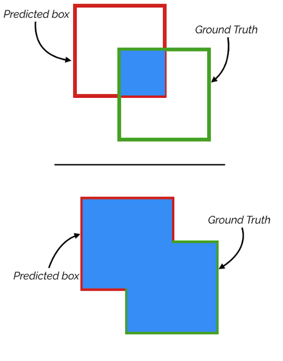

<style>
  slides > slide {
  overflow-x: auto !important;
  overflow-y: auto !important;
  }
</style>

```{r setup, include=FALSE}
knitr::opts_chunk$set(echo = FALSE)
#pfad und laufwerksbuchstabe anzupassen
Disk = "H"
mainpath = paste0(gsub("C", Disk, SubversionDirectory()),
                  "PRO/MCT/Deeplearning4ObjectDetection/")
#relative pfade
inputdir = normalizePath(paste0(mainpath, "09Originale"))
img_dir = normalizePath(paste0(mainpath, "09Originale/img"))
img_dir_per = normalizePath(paste0(mainpath, "09Originale/img_Shuffled"))
outdir = normalizePath(paste0(mainpath, "/01Predictions"))

```

## Vorraussetzungen 
- Für die folgenden Beispiele müssen in der *.Rmd oben die relativen Pfade angepasst werden
- Aus CRAN sind folgende packages zu installieren: imager, devtools, abind, Matrix, jpeg
- Aus Github sind folgende packages zu installieren: image.darknet, ImageProcessing
    
## Installation

```{r, echo = TRUE}
#bei erster ausfuerung kommenterzeichen entfernen
# pkg = c("imager", "devtools", "abind", "Matrix", "jpeg")
# install.packages(pkg, dependencies = T)
# devtools::install_github("bnosac/image", 
#       subdir = "image.darknet", dependencies = T)
# devtools::install_github("Mthrun/ImageProcessing")
```
.


## Lade und Plotte Objektschablone: Beispiel
- 72 Bilder mit 847 Objekten sind verfuegbar
- Im Beispiel sind 16 Objekte markiert

```{r, echo = TRUE,,message=F,warning=F,fig.height=7,fig.width=7}
img01 = jpeg::readJPEG(paste0(img_dir, "/img1.jpg"))
#laedt List ObjectMasks
load(paste0(inputdir, "/ObjectMasks.rda"))
#Objekte im ersten Bild
names(ObjectMasks)[1:16]
#Generiert 3D arrays aus sparse matrizen
Woman = ImageProcessing::ConvertSparseList2Array(ObjectMasks$img_01_woman)
#Plot
ImageProcessing::PlotMaskImgOverlay(img01, Woman)
```
.


## Lade und Plotte Objektumrandung
- Im Beispiel ist "
    - dining table" ein Objekt zusammengesetzt aus vielen kleineren Objekten
    - Beispielsweise ist "pancakes" und "milk" markiert

```{r, echo = TRUE,message=F,warning=F}
#Lade Bild
img02=imager::load.image(paste0(img_dir_per,"/img2.jpg"))
#Lade Umrandung als Polygonzug
load(paste0(inputdir,"/ObjectNamesAndPolygons.rda"))

plot(img02)
xy=do.call(rbind,ObjectNamesAndPolygons$img2_pancakes$Polygons)
#resolution conversion
xy[,2]=xy[,2]
xy[,1]=xy[,1] 
lines(xy,lwd=10,col="darkred")

xy=do.call(rbind,ObjectNamesAndPolygons$img2_milk$Polygons)
#resolution conversion
xy[,2]=xy[,2]
xy[,1]=xy[,1] 
lines(xy,lwd=10,col="darkred")
```
.


## Definiere Objektdetektion von YOLO als Funktion
- Dokumentation der Funktion kann mit Operator ? aufgerufen werden
- Darknet_Model ist per Default YOLO model
    - Weil bei Installation mitgeliefert
    - Siehe Dokue image_darknet_model image.darknet::image_darknet_model
    - Moegliche Modelle in R: 
          https://github.com/bnosac/image/tree/master/image.darknet/
          
    - Weitere Informationen unter https://pjreddie.com/darknet/yolo/
    
=> Wir trainieren kein neuronales Netz an sondern evaluieren nur neue Testdaten!

- Threshold definiert den Schwellenwert ab welchen für Bereiche mit möglichen Objekte Annotationen gesucht werden

```{r, echo = TRUE,message=F,warning=F}
#?ImageProcessing::PredictObject_YOLO
## Darknet_Model wird per default auf YOLO gesetzt mit 
## Darknet_Model=image.darknet::image_darknet_model(...)
#PredictObject_YOLO(Filename, InDirectory, 
#  Darknet_Model, Threshold = 0.19, 
# OutDirectory = getwd(), PlotIt = FALSE)
```
.


## Vorteil YOLO: Automatische Objektdetektion salienter Objekte
- Yolo generiert 845 moegliche Schablonen mit moeglichen Objekten
   - Davon ist ein salientes Objekt über dem Schwellenwert als "person" klassifiziert und umrandet
- Boundingbox des detektierten Objektes sind hier in der Regel rechteckig
    - Im Beispiel unten in blau

```{r, echo = T,message=F,warning=F}
result1=ImageProcessing::PredictObject_YOLO(Filename="/img1.jpg",
                          InDirectory=img_dir_per,OutDirectory = outdir,PlotIt = T)
```
.


## Qualitätsmaße (QM)
- Im Allgemeinen sind die Schablonen nicht so exakt wie in dem bereitgestellten Datensatz
- Evaluation der Detektionsgüte über Klassifikationsfehler oder spezielle Qualitätsmaße
- QMs basieren auf Pixelevaluationen und vergleichen Objektdetektionsrahmen des Algorithmus mit vordefinierter Schablone, z.B.
    - Basierend auf Precision und Recall, z.B. AP, mAP, Details später
    - Basierend Intersection over Union (IoU) der Pixel, s.u.

```{r, echo = T,message=F,warning=F,fig.height=5,fig.width=5,fig.align="center"}
#Beispiel
ImageProcessing::PlotMaskImgOverlay(result1, Woman)
#Prinzip

```
.

## Objektdetektion von YOLO
- YOLO generiert wieder 845 moegliche Schablonen mit moeglichen Objekten
- Wieso kommt dieser Effekt auf?

```{r, echo = T,message=F,warning=F}
result2=ImageProcessing::PredictObject_YOLO(Filename="/img2.jpg",
                          InDirectory=img_dir_per,OutDirectory = outdir,PlotIt = T)
```
.

## Objektdetektion von YOLO bei einer Hierarchie von Teilen 
- YOLO erkennt im Beispiel nur das übergeordnete Objekt
    - z.B nur "dining table"
    - Entweder weil es besonders salient ist, d.h. Das Objekt wird vor der Summe seiner Komponenten erkannt
    - Oder die Objektklasse in Trainingsdaten bereits gelernt war, die Teilobjektklassen "milk" und "pancakes" aber unbekannt sind

```{r, echo = T,message=F,warning=F}
plot(result2)
```
.


## Nachteil einer automatisierten Objektdetektion von YOLO
- Bei einem Verständnis der Funktion neuronaler Netze lassen sich diese leicht "austricksen"
- Im Beispiel erkennt YOLO fälschlicherweise ein motorbike
- Welche Ursache liegt dahinter?

```{r, echo = T,message=F,warning=F}
result3=ImageProcessing::PredictObject_YOLO(Filename="/cww/img2.png",
                          InDirectory=img_dir_per,OutDirectory = outdir,PlotIt = T)
```
.

